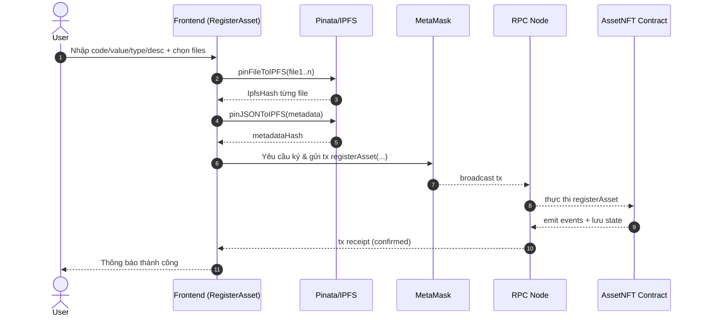
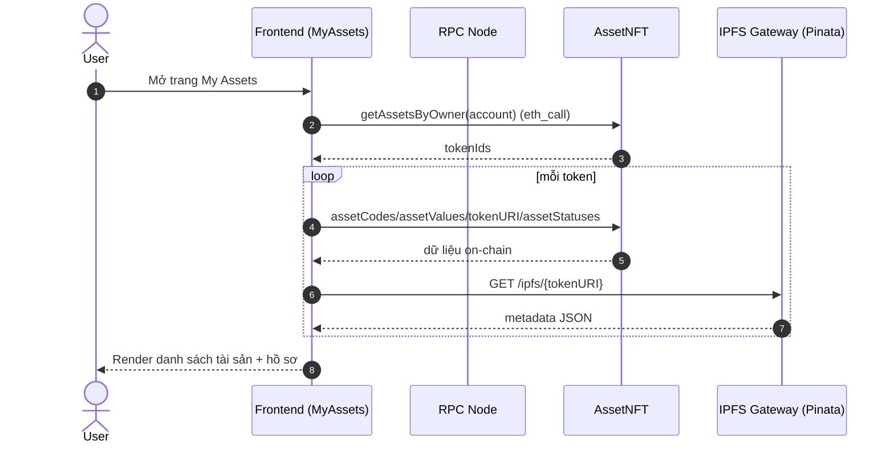
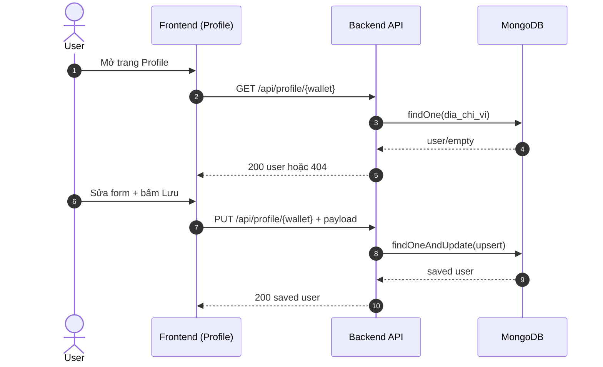

# Mô tả chức năng & luồng dữ liệu (chi tiết)

Tài liệu này mô tả **toàn bộ chức năng** hiện có trong dự án, cách dữ liệu đi qua từng lớp (**Frontend → Backend/MongoDB → Blockchain → IPFS/Pinata**), và các công nghệ/thiết kế liên quan.

## 1) Tổng quan kiến trúc

### 1.1 Thành phần

- **Frontend** (React/CRA): giao diện người dùng, kết nối MetaMask, gọi smart contract qua RPC, gọi Backend API để lưu “hồ sơ cá nhân”.
- **Backend** (Node.js/Express): cung cấp REST API cho hồ sơ cá nhân theo địa chỉ ví; kết nối MongoDB.
- **Database** (MongoDB): lưu dữ liệu off-chain cho `nguoi_dung` (không có mật khẩu; định danh bằng địa chỉ ví).
- **Blockchain** (Cronos Testnet – EVM): lưu dữ liệu “tài sản” ở dạng NFT ERC‑721 (mã, giá trị, trạng thái, tokenURI).
- **IPFS qua Pinata**: lưu file hồ sơ pháp lý và metadata JSON của NFT; frontend fetch metadata qua gateway.

### 1.2 Bản chất dữ liệu

- **On-chain** (trên contract NFT):
  - Chủ sở hữu token (`ownerOf(tokenId)`)
  - `assetCode`, `assetValue`, `assetStatus` theo `tokenId`
  - `tokenURI(tokenId)` (trong dự án này là **IPFS hash** của metadata JSON)
  - Lịch sử: suy ra từ **event logs** (mint/transfer/update status)

- **Off-chain**:
  - **File** và **metadata JSON** nằm trên IPFS (Pinata pin)
  - Hồ sơ cá nhân (tên, email, số điện thoại…) nằm trong MongoDB qua Backend API

### 1.3 Công nghệ

- Smart Contract: Solidity, OpenZeppelin `ERC721URIStorage`, `Ownable`
- Frontend: React 18 (CRA), `ethers` v6, `axios`, `react-router-dom`
- Backend: Express 5, `cors`, `dotenv`, `mongoose`
- DB: MongoDB + `mongosh` init script

## 2) Backend (API + MongoDB)

Backend entrypoint: [Backend/src/index.js](../Backend/src/index.js)

### 2.1 Middleware & cấu hình

- `dotenv.config()`: đọc biến môi trường từ `Backend/.env`.
- `cors({ origin: process.env.CORS_ORIGIN || true, credentials: true })`:
  - Nếu `CORS_ORIGIN` không set, `origin: true` nghĩa là phản hồi CORS theo Origin của request (mềm cho dev).
  - `credentials: true`: cho phép cookie/credentials (dù hiện API không dùng cookie).
- `express.json()`: parse JSON body.

**Biến môi trường Backend** (theo README):

- `MONGODB_URI` (default: `mongodb://127.0.0.1:27017/blockchain_assets`)
- `PORT` (default: `5000`)
- `CORS_ORIGIN` (dev thường `http://localhost:3000`)

### 2.2 Kết nối DB

File: [Backend/src/db.js](../Backend/src/db.js)

- `connectDb(mongoUri)`:
  1. validate có `mongoUri`
  2. `mongoose.set("strictQuery", true)`
  3. `mongoose.connect(mongoUri)`

**Luồng dữ liệu**:

- Env `MONGODB_URI` → `connectDb()` → MongoDB server → mở kết nối.

### 2.3 Model Người dùng

File: [Backend/src/models/NguoiDung.js](../Backend/src/models/NguoiDung.js)

Collection: `nguoi_dung`

Fields chính:

- `dia_chi_vi` (bắt buộc): string, unique, lowercase, regex `^0x[a-fA-F0-9]{40}$`
- `ho_ten`, `so_dien_thoai`, `dia_chi_lien_he`, `avatar_url`: tuỳ chọn
- `email`: tuỳ chọn, lowercase, **unique + sparse** (chỉ unique khi có giá trị)
- `trang_thai`: enum `hoat_dong | khoa`
- timestamps: `created_at`, `updated_at`

### 2.4 Hàm chuẩn hoá địa chỉ ví

Trong [Backend/src/index.js](../Backend/src/index.js) có helper:

- `normalizeDiaChiVi(raw)`:
  - `trim()` + `toLowerCase()`
  - kiểm tra regex strict: `0x` + đúng 40 hex ký tự
  - nếu sai → trả `null` (API trả 400)

Mục đích: chuẩn hoá key lưu DB để **không trùng lặp theo case**.

### 2.5 Endpoint: Health

- **GET** `/health`
- Response `200`:
  ```json
  { "ok": true }
  ```

### 2.6 Endpoint: Lấy profile theo ví

- **GET** `/api/profile/:dia_chi_vi`

**Xử lý**:

1. Server đọc param `:dia_chi_vi` → `normalizeDiaChiVi()`
2. Nếu invalid: `400 { message: "Địa chỉ ví không hợp lệ" }`
3. Query Mongo: `NguoiDung.findOne({ dia_chi_vi }).lean()`
4. Nếu không có: `404 { message: "Không tìm thấy" }`
5. Nếu có: `200` trả document người dùng.

**Ví dụ Response (200)**:

```json
{
  "_id": "...",
  "dia_chi_vi": "0xabc...",
  "ho_ten": "Nguyễn Văn A",
  "email": "a@example.com",
  "trang_thai": "hoat_dong",
  "created_at": "2026-02-05T...Z",
  "updated_at": "2026-02-05T...Z"
}
```

### 2.7 Endpoint: Tạo/cập nhật profile (upsert)

- **PUT** `/api/profile/:dia_chi_vi`

**Mục tiêu**: tạo mới nếu chưa có profile, hoặc cập nhật các field được phép.

**Field được phép cập nhật** (whitelist):

- `ho_ten`, `email`, `so_dien_thoai`, `dia_chi_lien_he`, `avatar_url`

**Cơ chế set/unset**:

- Nếu field **không gửi** (`undefined`) → bỏ qua, không thay đổi.
- Nếu field là `null` hoặc `""` → đưa vào `$unset` để xoá field khỏi document.
- Nếu có giá trị → `$set`.

**Upsert**:

- `$setOnInsert` chỉ áp dụng khi document chưa tồn tại:
  - `dia_chi_vi` (normalized)
  - `trang_thai: "hoat_dong"`
  - `created_at`

**Response**:

- `200` trả document sau cập nhật.

**Lỗi thường gặp**:

- Email trùng (unique) → Mongoose throw → backend bắt và trả `400 { message: err.message }`.

**Lưu ý bảo mật**:

- Code có ghi chú: hiện endpoint này chỉ demo; chuẩn “Web3 login” nên yêu cầu user **ký message** để chứng minh sở hữu ví trước khi cập nhật hồ sơ.

## 3) Database init

Files:

- [Database/init_mongo.js](../Database/init_mongo.js)
- [Database/README.md](../Database/README.md)

Chức năng script:

- Tạo DB `blockchain_assets`
- Tạo/cập nhật validator cho collection `nguoi_dung`
- Tạo index unique cho `dia_chi_vi`, và unique+sparse cho `email`
- (Tuỳ chọn) seed mẫu

## 4) Smart Contracts

### 4.1 Contract đang dùng: AssetNFT

File: [Backend/contracts/AssetNFT.sol](../Backend/contracts/AssetNFT.sol)

**Chuẩn**: ERC‑721 + lưu tokenURI theo token (ERC721URIStorage).

#### 4.1.1 State và ý nghĩa

- `_nextTokenId`: token id kế tiếp (bắt đầu từ 0).
- `assetStatuses[tokenId]`: trạng thái vòng đời:
  - `0 Active` (Đang sử dụng)
  - `1 Maintenance` (Bảo trì)
  - `2 Retired` (Ngưng sử dụng)
  - `3 Liquidated` (Thanh lý)
- `assetValues[tokenId]`: giá trị (VNĐ)
- `assetCodes[tokenId]`: mã tài sản (string)

#### 4.1.2 Events (lịch sử)

- `AssetMinted(tokenId, owner, assetCode, value)`
- `AssetStatusUpdated(tokenId, status, updatedBy, timestamp)`
- `AssetTransferred(tokenId, from, to, timestamp)`

Frontend sẽ query logs các event này để dựng **timeline**.

#### 4.1.3 Hàm: registerAsset

`registerAsset(address to, string assetCode, string tokenURI, uint256 value) returns (uint256)`

**Tác dụng**: mint NFT đại diện tài sản mới.

**Luồng on-chain**:

1. `tokenId = _nextTokenId++`
2. `_mint(to, tokenId)`
3. `_setTokenURI(tokenId, tokenURI)`
4. set mappings: `assetValues`, `assetCodes`, `assetStatuses[tokenId]=Active`
5. emit event Mint + StatusUpdated

**Dữ liệu đầu vào** (từ frontend):

- `to`: ví user
- `assetCode`: form nhập
- `tokenURI`: trong dự án là **IPFS hash metadata JSON**
- `value`: số VNĐ

#### 4.1.4 Hàm: transferAsset

`transferAsset(address to, uint256 tokenId)`

- Gọi `safeTransferFrom(msg.sender, to, tokenId)`
- emit `AssetTransferred`

**Ràng buộc**: OpenZeppelin ERC721 đảm bảo chỉ owner/approved mới được chuyển.

#### 4.1.5 Hàm: updateAssetStatus

`updateAssetStatus(uint256 tokenId, uint8 statusIndex)`

- Chỉ owner token được đổi: `ownerOf(tokenId) == msg.sender`
- `statusIndex <= 3`
- Update mapping + emit `AssetStatusUpdated`

#### 4.1.6 Hàm: getAssetsByOwner

`getAssetsByOwner(address owner) returns (uint256[] memory)`

- Lấy `balanceOf(owner)` rồi tạo mảng kết quả.
- Duyệt `i` từ 0 → `_nextTokenId-1`, nếu `_ownerOf(i)==owner` thì push vào kết quả.

**Lưu ý**: Đây là cách demo. Token nhiều sẽ nặng cho RPC (dù là view/eth_call).

### 4.2 Contract phụ: AssetRegistry (chưa tích hợp)

File: [Backend/contracts/AssetRegistry.sol](../Backend/contracts/AssetRegistry.sol)

- Registry theo `assetCode` (string) → struct Asset.
- Có `verifier` (người deploy), chỉ verifier được gọi `verifyAsset()`.
- Rule: chỉ asset Verified mới `transferAsset()`.

Hiện frontend không gọi contract này.

## 5) Frontend

### 5.1 App: kết nối ví + route

File: [Frontend/src/App.js](../Frontend/src/App.js)

State chính:

- `account`: địa chỉ ví hiện tại (string)
- `contract`: instance `ethers.Contract` trỏ vào AssetNFT

#### 5.1.1 connectWallet()

Luồng:

1. `ethers.BrowserProvider(window.ethereum)`
2. `ensureExpectedNetwork(provider)`:
   - nếu chainId khác → `wallet_switchEthereumChain`
   - nếu chưa add chain (4902) → `wallet_addEthereumChain`
3. Lấy `signer` và `address` → set `account`
4. `provider.getCode(CONTRACT_ADDRESS)` kiểm tra có contract thật
5. new `ethers.Contract(CONTRACT_ADDRESS, ABI, signer)` → set `contract`

#### 5.1.2 Listener MetaMask

- `accountsChanged`: reset state (user cần connect lại để đảm bảo signer/contract sync)
- `chainChanged`: reset state

### 5.2 Navbar

File: [Frontend/src/components/Navbar.js](../Frontend/src/components/Navbar.js)

- Hiển thị link menu.
- Nếu chưa có `account`: nút “Kết nối Ví” gọi `connectWallet`.
- Nếu đã có `account`: hiển thị địa chỉ rút gọn + nút “Đăng xuất” gọi `disconnectWallet`.

### 5.3 Home: thống kê theo ví

File: [Frontend/src/components/Home.js](../Frontend/src/components/Home.js)

- Khi có `contract` và `account` → gọi `fetchWalletStats()`.

`fetchWalletStats()`:

1. `tokenIds = contract.getAssetsByOwner(account)`
2. Với mỗi tokenId, đọc song song:
   - `assetValues(tokenId)`
   - `assetStatuses(tokenId)`
3. Tổng hợp:
   - `totalAssets = tokenIds.length`
   - `totalValue` dùng BigInt cộng dồn
   - `byStatus[0..3]` đếm theo status index
4. Render card tổng quan + biểu đồ phân bổ.

### 5.4 RegisterAsset: đăng ký tài sản mới (upload IPFS + mint)

File: [Frontend/src/components/RegisterAsset.js](../Frontend/src/components/RegisterAsset.js)

State:

- `formData`: `code`, `value`, `description`, `type`
- `files`: danh sách file hồ sơ
- `status`: hiển thị tiến trình

#### 5.4.1 uploadToIPFS(file)

- POST `https://api.pinata.cloud/pinning/pinFileToIPFS`
- multipart/form-data
- response: `{ IpfsHash: "..." }`

#### 5.4.2 uploadMetadataToIPFS(...)

- POST `https://api.pinata.cloud/pinning/pinJSONToIPFS`
- metadata JSON tạo theo chuẩn NFT:
  - `name`, `description`
  - `image`: gateway URL của file đầu tiên
  - `documents`: list các file kèm link gateway
  - `attributes`: Type + Created Date

#### 5.4.3 handleRegister()

Luồng end-to-end:

1. Validate đã connect contract và có file.
2. Upload từng file → tạo `uploadedDocs[]` + `mainImageHash`.
3. Upload metadata JSON → nhận `metadataHash`.
4. Gọi on-chain: `contract.registerAsset(account, code, metadataHash, value)`.
5. `await tx.wait()` để chắc chắn đã ghi vào block.
6. Reset form.

**Kết quả lưu trữ**:

- On-chain: `assetCode`, `assetValue`, `assetStatus`, `tokenURI=metadataHash`
- IPFS: files + metadata JSON

**Lưu ý quan trọng**: Pinata API key/secret đang hardcode trong frontend (phù hợp demo, không an toàn khi public).

### 5.5 MyAssets: danh sách tài sản + chuyển nhượng + trạng thái + lịch sử

File: [Frontend/src/components/MyAssets.js](../Frontend/src/components/MyAssets.js)

#### 5.5.1 loadMyAssets()

Luồng:

1. `tokenIds = contract.getAssetsByOwner(account)`
2. Với mỗi tokenId, đọc on-chain:
   - `assetCodes(tokenId)`
   - `assetValues(tokenId)`
   - `tokenURI(tokenId)`
   - `assetStatuses(tokenId)`
3. Fetch metadata off-chain:
   - GET `https://gateway.pinata.cloud/ipfs/${uri}`
   - parse: `image`, `description`, `documents`, `attributes.Type`
   - fallback: nếu không fetch được JSON, xem `uri` như link ảnh trực tiếp.
4. Render card cho từng tài sản.

#### 5.5.2 handleTransfer()

- Gọi `contract.transferAsset(to, tokenId)`
- `await tx.wait()`
- reload danh sách.

#### 5.5.3 handleUpdateStatus()

- Gọi `contract.updateAssetStatus(tokenId, newStatusIndex)`
- `await tx.wait()`
- reload danh sách.

#### 5.5.4 handleViewHistory(tokenId)

Mục tiêu: dựng timeline lịch sử bằng event logs.

Luồng:

1. Lấy `provider` từ `contract.runner.provider`.
2. `latestBlock = await provider.getBlockNumber()`.
3. Quét log theo chunk để tránh giới hạn RPC (eth_getLogs thường giới hạn range):
   - `LOOKBACK_BLOCKS=20000`
   - `MAX_BLOCK_RANGE=1999`
4. Query 3 filter:
   - `AssetMinted(tokenId)`
   - `AssetStatusUpdated(tokenId)`
   - `AssetTransferred(tokenId)`
5. Chuẩn hoá:
   - Mint: cố lấy timestamp từ block, fallback “Ban đầu”
   - StatusUpdated/Transferred: timestamp lấy từ args event
6. Sort theo `(blockNumber, logIndex)` rồi đảo ngược để mới nhất lên đầu.

### 5.6 Profile: hồ sơ cá nhân (off-chain)

UI: [Frontend/src/components/Profile.js](../Frontend/src/components/Profile.js)
Service: [Frontend/src/services/profileService.js](../Frontend/src/services/profileService.js)

#### 5.6.1 normalizeWalletAddress()

- trim + lowercase
- regex `^0x[a-f0-9]{40}$`
- nếu invalid → throw error

#### 5.6.2 getProfile(walletAddress)

- axios GET `/api/profile/<diaChiVi>`
- nếu có `REACT_APP_API_BASE_URL` thì prefix base URL.

#### 5.6.3 upsertProfile(walletAddress, payload)

- axios PUT `/api/profile/<diaChiVi>` gửi JSON.

#### 5.6.4 Luồng UI

- Khi vào trang và có `account`: gọi `getProfile(account)`.
  - Nếu 404: hiển thị “chưa có hồ sơ” và cho phép tạo mới.
- Submit form: gọi `upsertProfile()`.

**Proxy dev**:

- [Frontend/package.json](../Frontend/package.json) có `"proxy": "http://localhost:5000"` nên khi dev, `/api/...` tự proxy sang backend.

## 6) Sơ đồ luồng dữ liệu (sequence)

### 6.1 Đăng ký tài sản



### 6.2 Xem danh sách tài sản



### 6.3 Cập nhật hồ sơ cá nhân



## 7) Điểm cần lưu ý (đúng theo code hiện tại)

- **AssetRegistry** tồn tại nhưng chưa được tích hợp vào UI/luồng chạy.
- Pinata API key/secret đặt trong frontend là rủi ro bảo mật (demo OK; production nên chuyển upload qua backend hoặc dùng cơ chế token an toàn).
- Profile API hiện **không có xác thực chữ ký ví**; ai biết địa chỉ ví đều có thể PUT nếu backend public (README cũng đã ghi chú).

---

Nếu bạn muốn, mình có thể viết thêm một tài liệu ngắn gọn dạng “Tóm tắt thuyết trình” (1–2 trang) để bạn trình bày nhanh các luồng chính.
